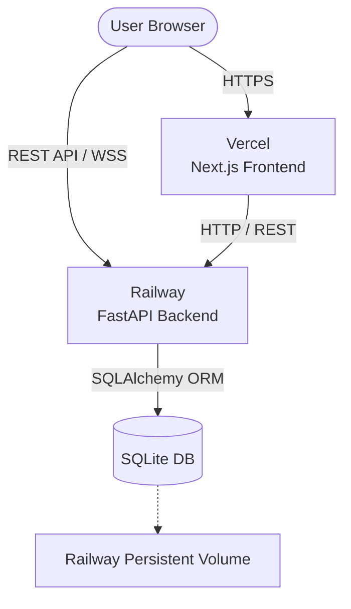
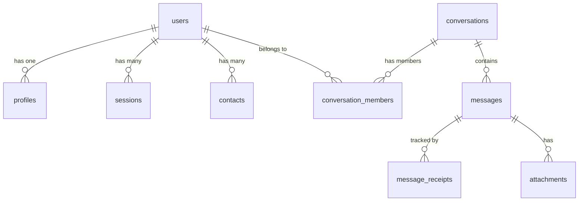
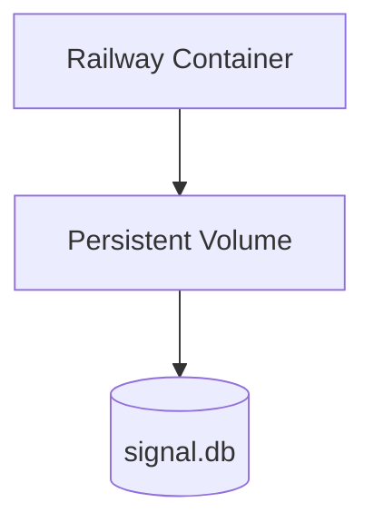

# Secure Messaging Platform — Signal Clone

## 1. Project Overview
This is a full-stack, real-time messaging application inspired by Signal, built as a Software Development Engineer (SDE) assignment. The platform allows users to register via phone numbers, manage profiles with local avatars, manage contacts, and participate in direct or group chats. 

It heavily emphasizes real-time UX—featuring instant message delivery, live typing indicators, accurate sent/delivered/read receipts, unread conversation badging, and accurate online/last-seen presence using native FastAPI WebSockets and robust SQLite persistence. 

*Note: Authentication is mocked with a hardcoded OTP, and the Signal Protocol encryption is not actually implemented. The focus of this project is on the full-stack system architecture, database design, and real-time interaction logic.*

## 2. Features

### Authentication / Onboarding
- **Phone Login**: Users authenticate via a phone number and a mocked OTP.
- **New-user profile setup**: First-time users are prompted to set up their profile.
- **Avatar selection**: Users choose from 5 pre-loaded, local cartoon avatars (no external APIs).
- **Session persistence**: HTTP-only cookies securely persist user sessions across reloads.
- **Logout**: Instantly destroys the session cookie and navigates to the login screen.

### Contacts
- **Add contacts**: Add existing users by their phone number.
- **Search users**: Quickly filter contacts by name.

### Conversations
- **Conversation list**: Sidebar dynamically lists all active chats.
- **Conversation sorting**: Chats are automatically sorted by the most recent message timestamp.
- **Unread counts**: Dynamic unread badges calculate missed messages, resetting instantly upon opening the chat.
- **Last-message previews**: Snippets of the newest message shown directly in the list.
- **Online/last-seen**: Real-time status ("Online" or "Last seen recently") derived from live WebSocket connections.

### Direct Messaging
- **Real-time WebSocket messaging**: Messages are broadcast and received instantly without polling.
- **Message persistence**: All messages are reliably written to SQLite.
- **Sent/received message alignment**: Received messages snap to the left; sent messages cleanly snap to the right.
- **Typing indicators**: Instant `typing...` notifications that identify the exact user typing, completely transient and not stored in the DB.

### Groups
- **Create group**: Fully functional group creation with a dedicated name.
- **Group Details**: Clickable group headers to view member lists and admin badges.
- **Group messaging**: Real-time broadcast to all group members, with sender names attached to incoming bubbles.

### UI/UX
- **Signal-inspired dark UI**: Sleek, privacy-focused visual aesthetic using Tailwind.
- **Light/dark theme**: Fully persistent global theme toggle.
- **Interactive Forms**: Smooth transitions and modal overlays for settings and profile management.

### Placeholder Features
- **Voice / Video calls**: Clicking call buttons elegantly triggers "Coming Soon" toast alerts.
- **Real E2EE**: Placeholder only; traffic uses HTTPS/WSS in production, but messages are stored in plain text.

## 3. Tech Stack

| Technology | Purpose |
|------------|---------|
| **Next.js** | Provides robust React architecture, fast routing, and SEO optimization. |
| **TypeScript** | Enforces static typing, reducing runtime errors and improving DX. |
| **React** | Component-based UI library for dynamic frontend states. |
| **Tailwind CSS** | Utility-first styling for rapid, consistent, and responsive UI design. |
| **FastAPI** | High-performance Python backend perfect for REST and WebSockets. |
| **Python** | Backend scripting language for rapid, readable logic. |
| **SQLAlchemy** | Powerful ORM for Python to interact securely with the SQL database. |
| **SQLite** | Lightweight, file-based SQL database ideal for simple persistence without heavy infra. |
| **WebSockets** | Native FastAPI WebSockets for bi-directional, persistent real-time communication. |
| **Vercel** | Seamless edge-network deployment for the Next.js frontend. |
| **Railway** | Cloud platform providing Docker-like deployment with persistent storage volumes. |

## 4. System Architecture



- **Vercel / Frontend**: Serves the React application, handles local UI state, and initiates WebSocket connections directly to the backend.
- **Railway / Backend**: Serves REST endpoints for CRUD operations and manages a WebSocket Connection Manager to track active users and broadcast messages.
- **SQLite / Volume**: The database exists as a `.db` file mounted on a persistent volume so it survives application restarts and redeploys.

## 5. Database Schema

The database relies on SQLAlchemy mapped to a normalized SQLite schema. 

### `users`
Represents the core account identity and connection lifecycle.
- `id` (Integer, PK): Unique identifier.
- `phone` (String, Unique): The user's phone number.
- `is_active` (Boolean): Soft-delete toggle.
- `last_seen_at` (DateTime): Updated on WebSocket disconnect.
- `created_at` / `updated_at` (DateTime).

### `profiles`
Separates public display information from core identity, allowing dynamic updates.
- `user_id` (Integer, PK, FK -> users.id).
- `display_name` (String).
- `avatar_url` (String): Local path (e.g. `/avatars/avatar1.svg`).
- `about` (String).

### `sessions`
Tracks authentication tokens.
- `id` (Integer, PK).
- `user_id` (Integer, FK -> users.id).
- `token_hash` (String, Unique): Hashed representation of the session cookie.
- `expires_at` / `revoked_at` (DateTime).

### `contacts`
Tracks known user connections.
- `id` (Integer, PK).
- `user_id` / `contact_user_id` (Integer, FKs). Includes a UniqueConstraint to prevent duplicates.

### `conversations`
The core entity tying users and messages together.
- `id` (Integer, PK).
- `type` (String): 'direct' or 'group'.
- `name` / `avatar_url` (String, Nullable): Used strictly for groups.
- `created_by` (Integer, FK -> users.id).

### `conversation_members`
A join-table mapping users to conversations, tracking unread states natively per-user.
- `id` (Integer, PK).
- `conversation_id` (Integer, FK).
- `user_id` (Integer, FK).
- `role` (String): 'member' or 'admin'.
- `unread_count` (Integer): Incremented on incoming messages, zeroed out when the chat is opened.

### `messages`
Stores the actual chat payloads.
- `id` (Integer, PK).
- `conversation_id` (Integer, FK).
- `sender_id` (Integer, FK).
- `content` (String).
- `message_type` (String): text, image, etc.

### `message_receipts`
Tracks delivery status.
- `id` (Integer, PK).
- `message_id` / `user_id` (Integer, FKs).
- `status` (String): 'sent', 'delivered', 'read'.

### `attachments`
Handles binary file metadata (currently unused but schema-ready).
- `id` (Integer, PK), `message_id` (Integer, FK), `file_url`, `file_name`.

## 6. Database Relationships



- **Why `conversation_members`?**: Grouping chats as a distinct entity allows easy scaling to N-sized groups. Direct chats are just conversations where max members = 2.
- **Direct Chats vs Groups**: `conversations.type` distinguishes them. For direct chats, the UI automatically computes the "Name" and "Avatar" based on the *other* member's profile.

## 7. Direct Chat Database Design

When User A starts a chat with User B:
1. The backend verifies if a `type="direct"` conversation already exists between them by querying `conversation_members` overlaps.
2. If it does not exist, it inserts a new `conversations` row.
3. It inserts two `conversation_members` rows (one for A, one for B).
4. Messages are subsequently tied to the `conversations.id`.

## 8. Group Database Design

Creating a group:
1. User provides a name and a list of contact IDs.
2. Backend creates a `conversations` row with `type="group"` and `name="Group Name"`.
3. Backend inserts N `conversation_members` rows. The creator gets `role="admin"`.
4. Anyone in the group can post messages to `conversations.id`.

## 9. Message Lifecycle

1. **User types**: Frontend pushes JSON over the active WebSocket (`type: "message"`).
2. **Backend intercepts**: `handle_ws_event` validates the WebSocket's tied session.
3. **Persist**: The message is synchronously written to SQLite `messages` table.
4. **Update Unreads**: `unread_count` is incremented by 1 for all members *except* the sender.
5. **Broadcast**: The backend loops through its active `ConnectionManager` and forwards the payload to any members currently online. 
6. **Offline handling**: If a user is offline, the WS broadcast silently skips them. Since the message was persisted to SQLite, they will fetch it via the REST API when they next log in.

## 10. Typing Indicator

Typing events are entirely transient. When a user presses a key, the frontend emits `{ type: "typing", conversation_id: 123 }`. 

The backend instantly broadcasts this to other active members of `123`. The payload dynamically injects the sender's actual `user_id`. The receiving frontend locates that `user_id` in the local `activeConv.members` array to cleanly display `[Display Name] is typing...` without relying on the current user's name or writing anything to the database.

## 11. Online / Last Seen

- The `ConnectionManager` tracks `active_connections = { user_id: [WebSocket] }`.
- **Connect**: Fires a global `presence` WS event (`status: "online"`) to all clients.
- **Disconnect**: Fires a `presence` WS event (`status: "offline"`) and updates `last_seen_at` in the SQLite `users` table.

## 12. Authentication

Authentication leverages a mocked OTP system (bypassing real SMS for demo purposes).
1. Client POSTs a phone number.
2. Client submits the dummy OTP (e.g. 123456).
3. Backend generates a secure cryptographic token.
4. Token is hashed and stored in `sessions`, and returned to the client as an `HttpOnly` cookie.
5. All subsequent REST API calls and the WebSocket handshake rely on parsing this securely transmitted cookie.

## 13. API Documentation

### Authentication
- `POST /api/auth/request-otp`: Trigger mock SMS. Body: `{ phone }`.
- `POST /api/auth/verify-otp`: Validate code, set HttpOnly session cookie. Body: `{ phone, code }`.
- `GET /api/auth/profile`: Returns current user's combined User + Profile data. Auth required.
- `POST /api/auth/profile`: Updates Display Name, About, and local Avatar URL. Auth required.
- `POST /api/auth/logout`: Revokes session, deletes cookie. Auth required.

### Contacts
- `GET /api/contacts/`: List current user's saved contacts. Auth required.
- `POST /api/contacts/`: Add a contact by phone number. Auth required.

### Conversations
- `GET /api/conversations/`: Returns all conversations the user is a member of (includes `unread_count`). Auth required.
- `POST /api/conversations/direct`: Create/Fetch a 1-on-1 chat. Body: `{ contact_user_id }`. Auth required.
- `POST /api/conversations/group`: Create a group chat. Body: `{ name, member_ids: [] }`. Auth required.
- `GET /api/conversations/{id}/messages`: Fetch full message history. Auth required.
- `POST /api/conversations/{id}/read`: Resets `unread_count` for the current user to 0. Auth required.

## 14. WebSocket API

Endpoint: `ws://[BACKEND_URL]/ws` (relies on HttpOnly cookie for auth).

**Client to Server Events:**
- `message`: `{ type: "message", conversation_id: int, content: str }` -> Persists and broadcasts text.
- `typing`: `{ type: "typing", conversation_id: int }` -> Broadcasts transient typing state.

**Server to Client Events:**
- `new_message`: `{ type: "new_message", message: { id, content, sender_id, created_at, ... } }` -> Informs UI to render a new bubble.
- `typing`: `{ type: "typing", conversation_id: int, user_id: int }` -> Triggers the typing UI for a specific sender.
- `presence`: `{ type: "presence", user_id: int, status: "online"|"offline" }` -> Triggers online dot toggles.

## 15. Project Structure

```text
├── backend/
│   ├── main.py              # FastAPI entrypoint
│   ├── ws_manager.py        # ConnectionManager for WebSockets
│   ├── db/                  # Database connection setup
│   ├── models/              # SQLAlchemy schema definitions
│   ├── routers/             # REST endpoint definitions
│   ├── schemas/             # Pydantic validation models
│   └── data/signal.db       # SQLite Database
├── frontend/
│   ├── src/app/             # Next.js App Router (page.tsx, layout.tsx, globals.css)
│   ├── public/avatars/      # Locally stored lightweight SVGs
│   └── tailwind.config.ts   
├── README.md
├── railway.json             # Deployment configs
└── .env.example
```

## 16. Local Development

**Prerequisites:** Python 3.10+, Node.js 18+

**Backend:**
```bash
cd backend
python -m venv venv
# On Windows: .\venv\Scripts\activate | On Mac/Linux: source venv/bin/activate
pip install -r requirements.txt
python main.py # Automatically runs Uvicorn on port 8000
```

**Frontend:**
```bash
cd frontend
npm install
npm run dev
```

## 17. Environment Variables

Create a `.env` file in the `frontend` directory based on `.env.example`.

**Frontend:**
- `NEXT_PUBLIC_API_URL`: `http://localhost:8000` (Local) or `https://backend-production-url.up.railway.app` (Prod)
- `NEXT_PUBLIC_WS_URL`: `ws://localhost:8000/ws` (Local) or `wss://backend-production-url.up.railway.app/ws` (Prod)

*The backend currently runs out-of-the-box locally without external variables due to the local SQLite DB setup.*

## 18. Seed Data

The database (`signal.db`) comes pre-seeded.
- **Why?**: The application should be immediately usable after startup/demo login without requiring a cold-start manual setup of multiple accounts.
- **What's included?**: 8 seeded users with assigned local avatars, 3 group chats (e.g. "Project Team"), dozens of direct conversations, and realistic, context-aware message history with randomized timestamps.

## 19. Deployment — Vercel + Railway

**Backend (Railway):**
1. Create a Railway project.
2. Deploy the `backend` folder.
3. Add a **Persistent Volume** in Railway and mount it to `/app/data` (Ensure the backend is configured to store `signal.db` there).
4. *Important*: If you do not use a persistent volume, the SQLite database will be wiped every time the Railway container redeploys.
5. Railway handles the start command automatically via `uvicorn main:app --host 0.0.0.0 --port $PORT`.

**Frontend (Vercel):**
1. Import the repository into Vercel.
2. Set the Root Directory to `frontend`.
3. Add Environment Variables:
   - `NEXT_PUBLIC_API_URL`: `https://[RAILWAY_URL]`
   - `NEXT_PUBLIC_WS_URL`: `wss://[RAILWAY_URL]/ws`
4. Deploy.

## 20. CORS for Production

FastAPI is configured with `CORSMiddleware`. In production, ensure the `allow_origins` array contains the exact URL of your deployed Vercel frontend (e.g., `https://my-signal-clone.vercel.app`). Do not use `allow_origins=["*"]` because credentialed auth (`HttpOnly` cookies) explicitly strictly forbids wildcard CORS origins.

## 21. SQLite + Railway Persistence


Railway containers are ephemeral. Without a volume, `signal.db` is destroyed on every deploy. Mounting a persistent volume ensures SQLite state survives redeployments. 

## 22. Security / Production Notes
- **Mock OTP**: Strictly for demo purposes. Do not use in production without connecting Twilio/AWS SNS.
- **E2EE**: Real Signal Protocol encryption is NOT implemented. HTTPS encrypts transport, but DB messages are plain text.
- **Cookies**: Sessions use `HttpOnly`, `SameSite=lax` cookies to prevent XSS exfiltration of tokens.

## 23. Future Enhancements

1. **Real End-to-End Encryption**
   - **Schema changes**: Add `device_keys`, `pre_keys` tables. The `messages` table would store an encrypted ciphertext blob rather than plain string content.
2. **Multiple Devices**
   - **Schema changes**: Add `devices` table. Move WebSockets mapping from `user_id` to `device_id`.
3. **Attachments**
   - **Schema changes**: Utilize the currently dormant `attachments` table. Binary files would be pushed to AWS S3, and `file_url` would be stored in the DB.

## 24. Database Design Decisions

- **Why SQLite?**: Provides robust RDBMS relationships locally without requiring Dockerized PostgreSQL for a simple SDE assignment.
- **Why Separate Users and Profiles?**: Identity (Phone Number, Auth) rarely changes, but Display Names and Avatars change frequently. Isolating them reduces friction on auth-critical tables.
- **Why `conversation_members`?**: A standard many-to-many join table allows limitless groups and natively supports tracking per-user metrics like `unread_count` efficiently without running complex subqueries on the `messages` table.

## 25. Interview Explanation

**How to Explain This Project in an Interview:**
*"I built a real-time messaging application utilizing a Next.js frontend and a FastAPI backend. To manage persistence while keeping the infra lightweight, I used SQLite mapped via SQLAlchemy. For real-time UX, instead of polling the database, I implemented native FastAPI WebSockets to broadcast messages, typing indicators, and presence tracking in real-time. I handled offline messaging gracefully—if a WebSocket connection is dead, the payload is still safely committed to SQLite, meaning the user fetches the history via REST the next time they authenticate."*

**Q: Why WebSockets over HTTP Polling?**
A: WebSockets establish a single persistent TCP connection, dramatically reducing HTTP overhead, latency, and DB spam for real-time applications like typing indicators.

**Q: How is the unread state managed?**
A: Instead of iterating over all messages, the `conversation_members` table tracks a direct `unread_count` integer. It bumps up via WS events and zeroes out via a single optimized REST call when the user focuses the chat.

## 26. Troubleshooting

- **CORS Error on Login**: Ensure frontend fetch calls explicitly use `credentials: "include"`, and backend `allow_origins` strictly matches the frontend URL (no wildcards).
- **WebSocket Disconnects Immediately**: Ensure the `session_token` cookie is successfully being set by `/api/auth/verify-otp`. WebSockets rely entirely on this cookie to authenticate the handshake.
- **Database Wiped on Railway**: Ensure the persistent volume is attached and the backend path maps to `/app/data` where `signal.db` lives.
